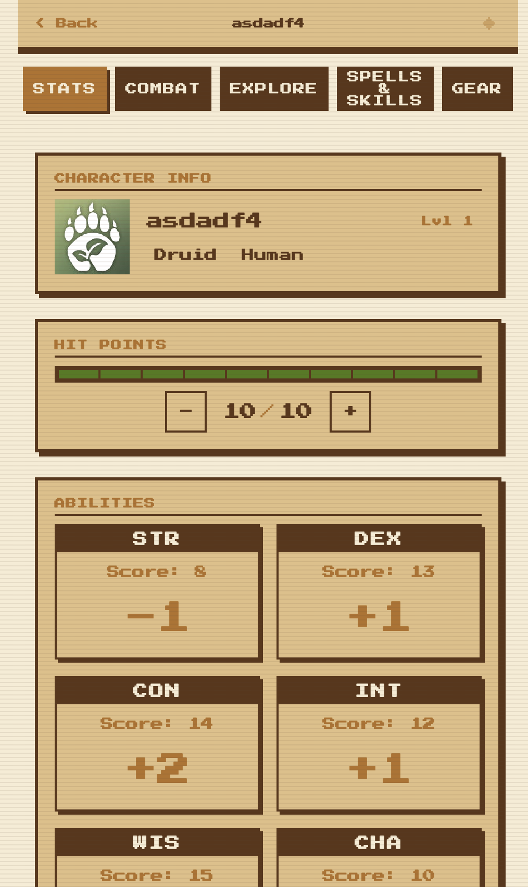
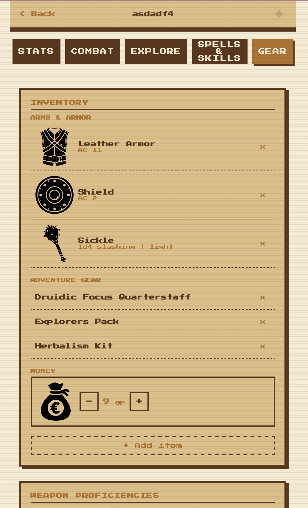

# D&D 5e Beginner Character Sheet 2024

A simple, interactive D&D 5e character sheet built for new players and the 2024 rules revision.

|  |  |
| :---------------------------------: | :---------------------------------: |

## Project Vision

This project is a beginner-first, single-page control panel for live table play that answers: **"what can I do right now?"**

- Icon-led, low-reading interface for first-time players.
- Five-tab in-session flow: Character, Battle, Explore, Spells & Skills, Gear.
- Focus on action clarity, spell/resource usage, and quick table decisions.

Canonical product vision and scope live in [`SPEC.md`](SPEC.md).


## Run

```bash
pnpm install
pnpm dev
```
